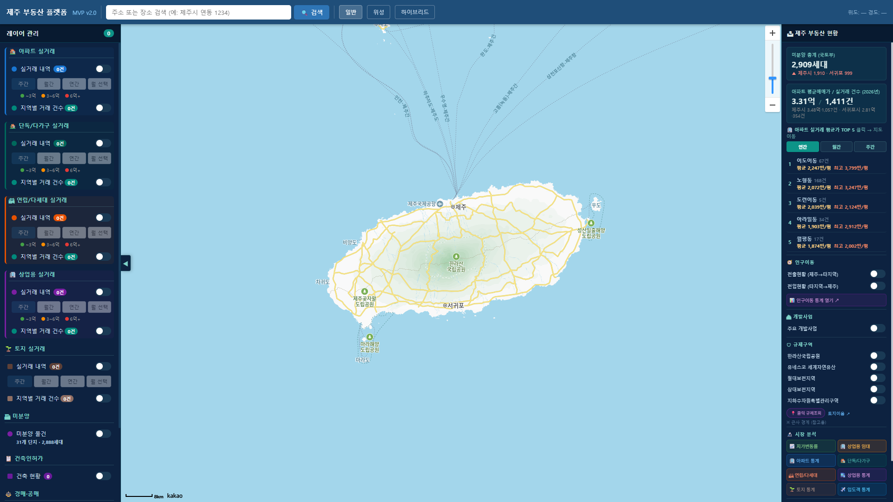
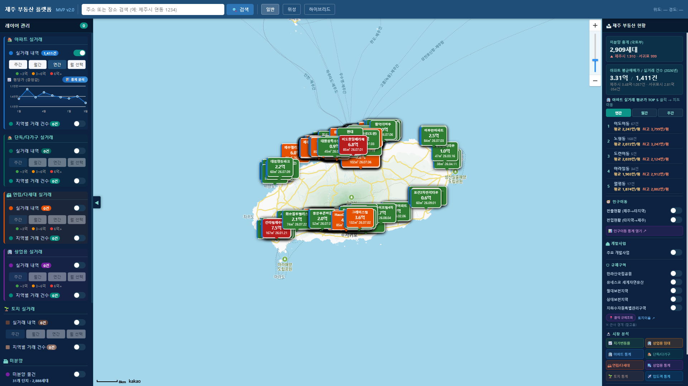
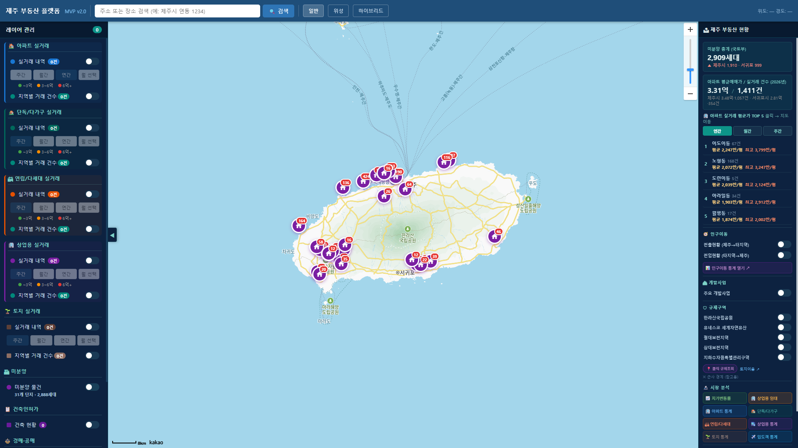
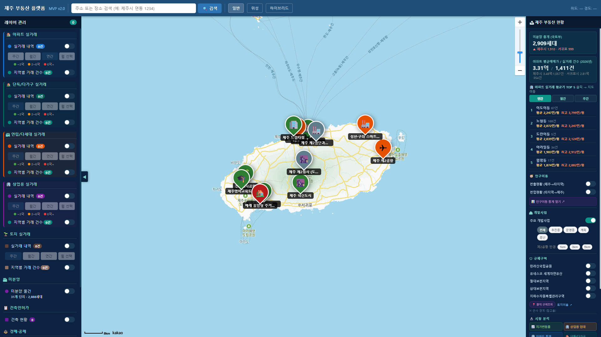
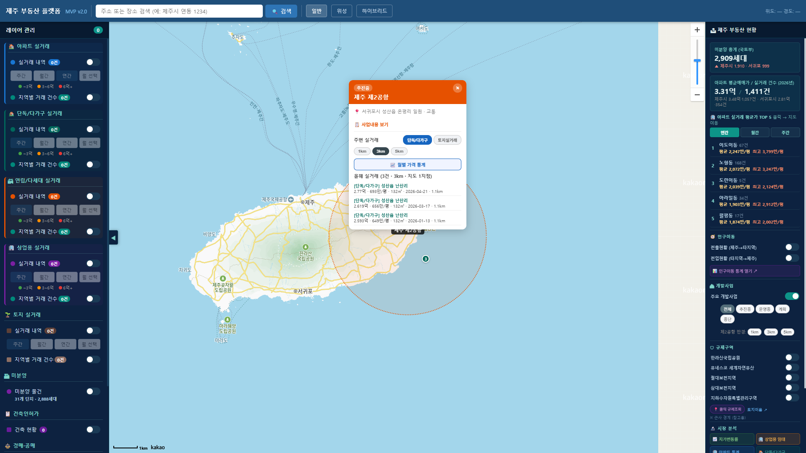
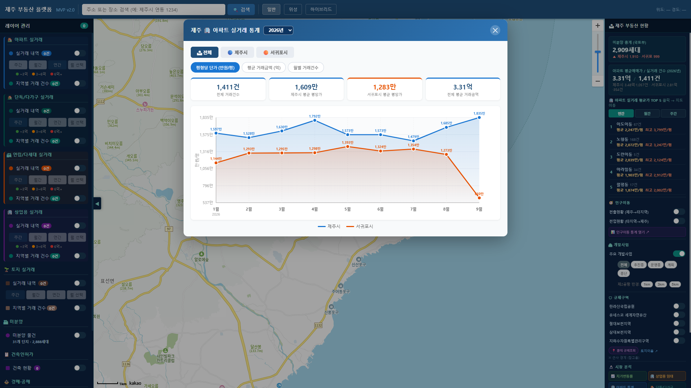

# 제주 부동산 플랫폼 — 일반 사용자 매뉴얼

**버전:** MVP v2.0  
**접속 주소:** [https://rekaber.github.io/jeju-platform/](https://rekaber.github.io/jeju-platform/)  
**대상:** 제주 부동산·토지·개발 정보를 지도로 살펴보고 싶은 일반 사용자

---

## 1. 이 플랫폼으로 할 수 있는 일

- 아파트·단독/다가구·연립·상업용·토지 **실거래**를 지도에서 확인
- **미분양** 단지, **건축인허가**, **공매** 정보 확인
- **주요 개발사업** 주변 실거래·가격 흐름 살펴보기
- **인구이동·지가·임대·입도객** 등 시장 통계 보기
- 규제구역(국립공원·보전지역 등) 참고 확인

> 참고용 정보입니다. 계약·투자 전 반드시 공식 자료(등기, 토지이음, 중개사 등)를 확인하세요.

---

## 2. 시작하기

### 2-1. 입장 화면

사이트에 들어가면 아래와 같은 입장 화면이 나타납니다.  
**「플랫폼 입장 →」** 버튼을 누르면 지도 화면으로 이동합니다.

### 2-2. 메인 화면 구성

입장 후 화면은 크게 네 부분으로 나뉩니다.

| 위치 | 이름 | 하는 일 |
|------|------|---------|
| 위 | 상단 바 | 검색, 지도 유형(일반/위성/하이브리드) |
| 왼쪽 | **레이어 관리** | 실거래·미분양·인허가 등 지도에 올릴 정보 켜기/끄기 |
| 가운데 | **지도** | 선택한 정보가 표시되는 메인 화면 |
| 오른쪽 | **제주 부동산 현황** | 요약 수치, TOP5, 개발·규제·시장 분석 |

왼쪽 패널이 넓으면 **「◀」** 버튼으로 접을 수 있습니다.

---

## 3. 실거래 내역 보기 (가장 많이 쓰는 기능)

### 3-1. 레이어 켜기

1. 왼쪽 **레이어 관리**에서 원하는 유형을 펼칩니다.  
   예: **🏠 아파트 실거래**
2. **「실거래 내역」** 옆 스위치를 **켜기(ON)** 합니다.
3. 기간을 고릅니다.
   - **주간** — 최근 7일 (기본값, 건수가 적을 수 있음)
   - **월간** — 최근 30일
   - **연간** — 올해 전체
   - **월 선택** — 특정 월만

연간으로 켜면 지도에 거래 마커가 많이 표시됩니다.

### 3-2. 마커 색과 팝업

- 색은 대략적인 **가격대**를 나타냅니다.  
  예: ~3억 / 3~6억 / 6억+
- 마커를 **클릭**하면 단지명, 금액, 면적, 계약일 등이 나옵니다.
- **「지역별 거래 건수」**를 켜면 동(읍·면·동)별 건수 버블이 표시됩니다.

### 3-3. 다른 유형도 같은 방식

| 왼쪽 메뉴 | 내용 |
|-----------|------|
| 단독/다가구 실거래 | 단독·다가구 주택 |
| 연립/다세대 실거래 | 빌라·연립 등 |
| 상업용 실거래 | 상가·업무용 등 |
| 토지 실거래 | 토지 (지목 필터: 대지/전·답/임야 등) |

여러 레이어를 동시에 켤 수 있지만, 처음에는 **한 종류만** 켜고 보는 것을 권장합니다.

---

## 4. 미분양 현황

1. 왼쪽에서 **🏗 미분양** → **미분양 물건** 스위치를 켭니다.
2. 지도에 단지 마커가 표시됩니다.
3. 마커를 클릭하면 미분양 세대, 분양가, 시행·시공사 등을 볼 수 있습니다.

오른쪽 패널의 **미분양 총계**는 요약 수치입니다. 단지 목록 합계와 기준(공표 시점)이 다를 수 있습니다.

---

## 5. 건축인허가 · 경매·공매

### 건축인허가
- **📋 건축인허가** → **건축 현황** ON
- **상태**(허가/착공/준공), **용도**(주거/상업 등), **연도**로 필터

### 경매·공매
- **⚖️ 경매·공매**에서 **온비드 공매** ON
- **「📂 공매 불러오기」**로 데이터를 불러올 수 있습니다. (공공데이터 API 키가 필요할 수 있음)
- 법원 경매는 **「대법원 경매 바로가기 ↗」**로 공식 사이트로 이동합니다.

---

## 6. 주요 개발사업

### 6-1. 사업 위치 보기

1. 오른쪽 **🏙 개발사업**에서 **주요 개발사업**을 켭니다.
2. 상태 필터: **전체 / 추진중 / 운영중 / 계획 / 중단**
3. 지도에 사업 핀(제2공항, 영어교육도시 등)이 나타납니다.

### 6-2. 사업 상세 · 주변 실거래

사업 핀을 **클릭**하면 상세 팝업이 열립니다.

팝업에서 할 수 있는 일:

| 기능 | 설명 |
|------|------|
| **사업내용 보기** | 사업 설명 펼치기 |
| **단독/다가구 · 토지실거래** | 주변 거래 유형 전환 |
| **1km / 3km / 5km** | 반경 변경 → 목록·통계·지도 원이 함께 바뀜 |
| **월별 가격 통계** | 올해 반경 내 월별 평균 차트 |
| **올해 실거래** | 올해·선택 반경 안 거래 목록 |

**팁**
- 팝업 **상단(주황색 헤더)**을 드래그하면 원하는 위치로 옮길 수 있습니다.
- 「N건」은 거래 **건수**이고, 「지도 M지점」은 같은 좌표가 겹쳐 **점으로 보이는 위치 수**입니다.

제2공항만 오른쪽 패널에서 **반경 1/3/5km** 원을 따로 켜 둘 수도 있습니다.

---

## 7. 규제구역 · 규제조회

오른쪽 **🛡 규제구역**에서 다음을 켤 수 있습니다.

- 한라산국립공원
- 유네스코 세계자연유산
- 절대보전지역 / 상대보전지역
- 지하수자원특별관리구역

**「📍 클릭 규제조회」**를 켠 뒤 지도를 클릭하면, 해당 지점의 규제(근사) 안내가 나옵니다.  
정확한 확인은 **「토지이음 ↗」** 등 공식 사이트를 이용하세요.  
(플랫폼의 경계는 **참고용 근사**입니다.)

---

## 8. 시장 분석 · 통계

오른쪽 **🔬 시장 분석** 버튼을 누르면 통계 창이 열립니다.

| 버튼 | 내용 |
|------|------|
| 지가변동률 | 분기별 지가 추이 |
| 상업용 임대 | 임대가격·공실·수익률 |
| 아파트 / 단독 / 연립 / 상업용 / 토지 통계 | 지역·연도별 실거래 통계 |
| 입도객 통계 | 관광객·실거래 상관 등 |

왼쪽 실거래 영역의 **「📊 통계 분석」**으로도 같은 종류의 통계를 열 수 있습니다.

통계 창에서는 보통 다음을 고를 수 있습니다.

- **전체 / 제주시 / 서귀포시**
- **평당(㎡당) 단가 · 평균 거래금액 · 월별 건수** 탭

창 **제목 줄**을 드래그하면 위치 이동이 가능한 통계 창도 있습니다.

### 인구이동
- **전출현황 / 전입현황** 스위치로 지도에 흐름 표시
- **「📊 인구이동 통계 열기 ↗」**로 상세 차트

---

## 9. 검색 · 지도 조작

1. 상단 검색창에 **주소 또는 장소명** 입력  
   예: `제주시 연동`, `성산읍`
2. **「🔍 검색」** 클릭 → 결과 선택 → 지도 이동
3. 지도 유형: **일반 / 위성 / 하이브리드**
4. 오른쪽 **+ / −** 로 확대·축소

---

## 10. 분석 도구 (심화)

| 도구 | 설명 |
|------|------|
| **지적편집도 (용도지역)** | 용도지역 타일을 지도에 표시 |
| **토지필지 형상 분석기** | 별도 분석 창(필지 형태 등) 열기 |

일반 조회만 할 때는 꼭 쓰지 않아도 됩니다.

---

## 11. 데이터에 대해 알아두기

| 항목 | 안내 |
|------|------|
| 실거래 | 국토부 공개 자료를 기반으로 하며, **공개 지연**이 있을 수 있습니다. 페이지를 열 때 자동으로 불러옵니다. |
| 기간이 「주간」일 때 | 최근 7일만 보여 **건수가 0에 가깝게** 보일 수 있습니다. **연간**으로 바꿔 보세요. |
| 미분양 | 공표 시점 기준 목록입니다. 총계 칩과 단지 합계가 다를 수 있습니다. |
| 개발사업 | 주요 사업 안내용으로 정리된 위치·설명입니다. |
| 규제구역 | **근사 경계(참고용)** 입니다. |
| 공매 | 불러오기·API 설정이 필요할 수 있습니다. |

---

## 12. 자주 묻는 질문

**Q. 지도를 켰는데 거래가 안 보여요.**  
A. 왼쪽에서 **실거래 내역 스위치가 ON**인지, 기간이 **주간**이 아닌지 확인하세요. **연간**으로 바꾸면 대부분 표시됩니다.

**Q. 개발사업 팝업이 지도를 가려요.**  
A. 팝업 **상단 헤더**를 마우스로 드래그해 옆으로 옮기면 됩니다.

**Q. 「40건」인데 지도 점이 적어요.**  
A. 같은 동·같은 좌표에 여러 건이 겹치면 점이 하나로 보입니다. 겹친 점은 **숫자 배지**로 건수를 표시하며, 목록의 건수와 「지도 N지점」을 함께 보세요.

**Q. 스마트폰에서도 되나요?**  
A. 웹 브라우저로 접속 가능합니다. 화면이 좁으면 왼쪽·오른쪽 패널을 접거나 스크롤해 사용하세요.

**Q. 이 정보로 계약해도 되나요?**  
A. **참고용**입니다. 최종 확인은 등기·토지대장·토지이음·공인중개사 등 공식 절차를 이용하세요.

---

## 13. 화면별 한눈에 보기

| 번호 | 화면 | 파일 |
|------|------|------|
| 1 | 입장 | `images/01-intro.png` |
| 2 | 메인 구성 | `images/02-main.png` |
| 3 | 아파트 실거래 | `images/03-apt-trades.png` |
| 4 | 미분양 | `images/04-unsold.png` |
| 5 | 개발사업 마커 | `images/05-dev-projects.png` |
| 6 | 개발사업 팝업 | `images/06-dev-popup.png` |
| 7 | 실거래 통계 | `images/07-stats.png` |

---

## 14. 문의 · 업데이트

- 플랫폼: [https://rekaber.github.io/jeju-platform/](https://rekaber.github.io/jeju-platform/)
- 기능·데이터 개선은 지속 반영됩니다. 매뉴얼 화면은 실제 UI와 약간의 차이가 있을 수 있습니다.

**문서 위치:** `docs/manual/사용자매뉴얼.md`
